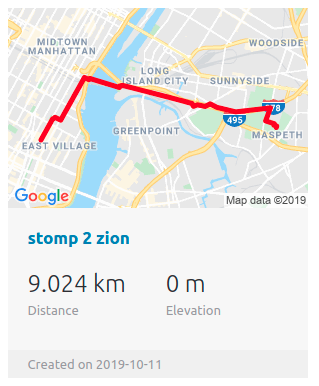

<!-- This README would normally document whatever steps are necessary to get the
application up and running.

Things you may want to cover:

* Ruby version

* System dependencies

* Configuration

* Database creation

* Database initialization

* How to run the test suite

* Services (job queues, cache servers, search engines, etc.)

* Deployment instructions

* ... -->

# [Struggle 2000](https://struggle2000.herokuapp.com/)

## Overview

Struggle 2000 lets you create your own custom running routes and activities.
You can view your aggregated activities and routes to see your progress over time.

## Implemented Technology

struggle 2000 runs on a PRRRR stack:

* P - Postgres is the database being used to store user information, route data, and activity data  
* RR - Ruby on Rails is the backend component which handles requests to the database and formats the data sent to the frontend  
* RR - React and Redux are the frontend components which maintain frontend state and render the individual pages a viewer sees when navigating the site  

## Feature Highlights

### * Route Index

Displaying route maps implements a completely separate API from the route creator. This static maps API
conveniently takes in a string of concatinated coordinates separated by a | character to display routes
in the query string request to the api.  This makes calling route data from the database simple as it
is already saved in this specific format instead of an array or object.  The static maps are their own
component, so they can be iterated over simply and displayed in a flexbox in the route index.  Individual
route display tiles look like the following:  

### * Activity Index

Displaying the index of all of a users activities is another important feature.  This tabled display allows
a user to compare their stats for all of their recorded activities over time.  They are presented in an clean
and orderly format.  Additionally, none of the data besides the sport and title is mandatory, so a user can create
a new activity even if they don't have access to the full range of data asked for in the form.

## Cream of the Crop Code Snippets

Below are some specific parts of the project I feel particularly proud of:  

* `const activities = this.props.activities.map(activity => {
            
            if(i % 2 === 0){
                cName = "table-row-dark"
                i++
            } else if (i % 2 === 1) {
                cName = "table-row-light"
                i++
            }
            
            if (activity.distance !== null) {
                activity.distance += " km"
            }
            
            if (activity.elevation !== null) {
                activity.elevation += " m"
            }

            return(
                
                <tr key={activity.id} className={cName}>
                    <td>{activity.sport}</td>
                    <td>{activity.date}</td>
                    <td>{activity.title}</td>
                    <td>{activity.time}</td>
                    <td>{activity.distance}</td>
                    <td>{activity.elevation}</td>
                </tr>
            )
        })`  
    This piece maps a user's activities prop array as a table row of html table datums.
    It alternates between light and dark background colors by specifying a css background property
    on even and odd numbers.  Units of measure are then added by checking if the associated activity
    is not null and concatinating a string on the end (just for display) of the data value.

* `const activitiesTitles = this.props.activities.reverse().map(activity => {
        if (i < 6)
        i++

        return <li>{activity.title}</li>
    })`  

    This piece iterates through a user's activities in reverse order and returns
    a list of most recent activities (since the activities array is populated in order
    of creation).  These li elements are display in the footers thorughout the project.